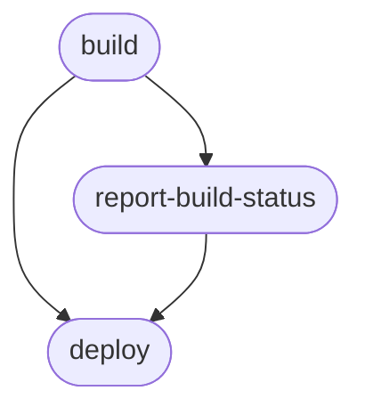

# GitHub Pages Demo

To publish a static website using GitHub Pages and GitHub Actions.


**GitHub Pages must be enabled**


With GitHub Page disabled in the repository:
```
Run actions/deploy-pages@v5
(node:2187) [DEP0040] DeprecationWarning: The `punycode` module is deprecated. Please use a userland alternative instead.
(Use `node --trace-deprecation ...` to show where the warning was created)
Fetching artifact metadata for "github-pages" in this workflow run
Found 1 artifact(s)
Creating Pages deployment with payload:
{
	"artifact_id": 8840092053,
	"pages_build_version": "2c261ec8e2cbad94bf32d4bfe6ff79bdf9fe34f5",
	"oidc_token": "***"
}
Error: Creating Pages deployment failed
Error: HttpError: Not Found
    at /home/runner/work/_actions/actions/deploy-pages/v5/node_modules/@octokit/request/dist-node/index.js:124:1
    at processTicksAndRejections (node:internal/process/task_queues:104:5)
    at createPagesDeployment (/home/runner/work/_actions/actions/deploy-pages/v5/src/internal/api-client.js:125:1)
    at Deployment.create (/home/runner/work/_actions/actions/deploy-pages/v5/src/internal/deployment.js:73:1)
    at main (/home/runner/work/_actions/actions/deploy-pages/v5/src/index.js:30:1)
Error: Error: Failed to create deployment (status: 404) with build version 2c261ec8e2cbad94bf32d4bfe6ff79bdf9fe34f5. Request ID F808:3DEBA2:C2CE87E:C7A350D:6A6FC18E Ensure GitHub Pages has been enabled: https://github.com/rramoscabral/GitHub-Training-Demos/settings/pages
```
> Note: View the last line **Ensure GitHub Pages has been enabled**


With GitHub Page enabled in the repository:
```
Run actions/deploy-pages@v5
(node:2120) [DEP0040] DeprecationWarning: The `punycode` module is deprecated. Please use a userland alternative instead.
(Use `node --trace-deprecation ...` to show where the warning was created)
Fetching artifact metadata for "github-pages" in this workflow run
Found 1 artifact(s)
Creating Pages deployment with payload:
{
	"artifact_id": 8871268738,
	"pages_build_version": "559383ce31c07147be8c8a07685c50f8f5d81ad4",
	"oidc_token": "***"
}
Created deployment for 559383ce31c07147be8c8a07685c50f8f5d81ad4, ID: 559383ce31c07147be8c8a07685c50f8f5d81ad4
Getting Pages deployment status...
Current status: updating_pages
Getting Pages deployment status...
Reported success!
```


## Demo Workflow


